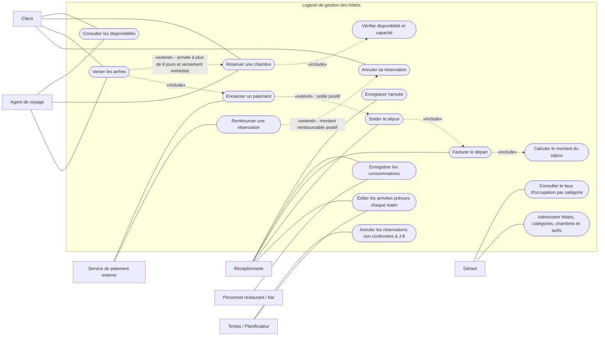

```mermaid
flowchart LR
    Client["Client"]
    Agent["Agent de voyage"]
    Reception["Réceptionniste"]
    Personnel["Personnel restaurant / bar"]
    Gerant["Gérant"]
    Paiement["Service de paiement externe"]
    Temps["Temps / Planificateur"]

    subgraph Systeme["Logiciel de gestion des hôtels"]
        direction TB
        Disponibilites(["Consulter les disponibilités"])
        Reserver(["Réserver une chambre"])
        Verifier(["Vérifier disponibilité et capacité"])
        Arrhes(["Verser les arrhes"])
        Encaisser(["Encaisser un paiement"])
        Annuler(["Annuler sa réservation"])
        Rembourser(["Rembourser une réservation"])
        AnnulationAuto(["Annuler les réservations non confirmées à J-8"])
        Arrivee(["Enregistrer l'arrivée"])
        Consommations(["Enregistrer les consommations"])
        Facturer(["Facturer le départ"])
        Calculer(["Calculer le montant du séjour"])
        Solder(["Solder le séjour"])
        ListeArrivees(["Éditer les arrivées prévues chaque matin"])
        Occupation(["Consulter le taux d'occupation par catégorie"])
        Administrer(["Administrer hôtels, catégories, chambres et tarifs"])
    end

    Client --- Disponibilites
    Client --- Reserver
    Client --- Arrhes
    Client --- Annuler

    Agent --- Disponibilites
    Agent --- Reserver
    Agent --- Arrhes

    Reception --- Arrivee
    Reception --- Consommations
    Reception --- Facturer
    Reception --- Solder
    Reception --- ListeArrivees

    Personnel --- Consommations

    Gerant --- Occupation
    Gerant --- Administrer

    Paiement --- Encaisser
    Paiement --- Rembourser

    Temps --- AnnulationAuto
    Temps --- ListeArrivees

    Reserver -.->|«include»| Verifier
    Arrhes -.->|"«extend» : arrivée à plus de 8 jours et versement immédiat"| Reserver
    Arrhes -.->|«include»| Encaisser
    Rembourser -.->|"«extend» : montant remboursable positif"| Annuler
    Facturer -.->|«include»| Calculer
    Solder -.->|«include»| Facturer
    Encaisser -.->|"«extend» : solde positif"| Solder
```
